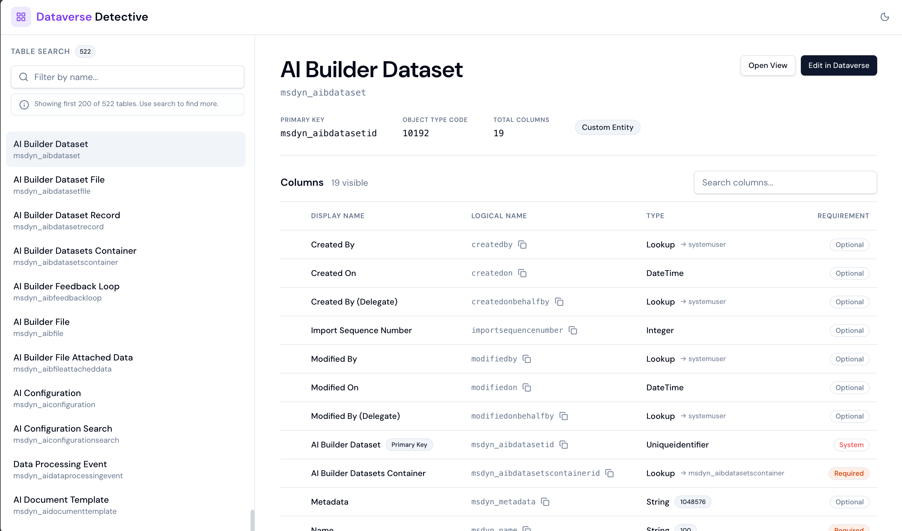

# Dataverse Detective

A lightweight “table schema detective” for **Microsoft Dataverse / Power Platform**: quickly search for Tables in the browser and inspect Columns metadata (type, required, primary key, lookup targets, choice options, etc.), with one-click entry points to Dynamics 365 Views and the Maker Portal.

> Designed to run as a **Power Platform Web Resource**: reads the Dataverse Web API directly via same-origin `/api/data/v9.2` (using the current signed-in user's permissions).

## Screenshot

> Save your screenshot as `web_screenshot.png` and it will show up here automatically.



## Features

- Table search and quick navigation (supports `?logicname=account` to jump directly to a table)
- Lazy-loaded Columns + column search (Display Name / Logical Name / Lookup Targets)
- Key info at a glance: Primary Key / Object Type Code / Total Columns / Custom Entity
- One-click copy for Logical Name
- Expand Choice types to view options (Picklist / State / Status / MultiSelectPicklist)
- Deep links
  - `Open View`: opens the table's list view in the current org (`/main.aspx?pagetype=entitylist&etn=...`)
  - `Edit in Dataverse`: opens the table definition page in the Maker Portal
- Light/Dark mode

## Getting Started

### Prerequisites

- Node.js 18+ (20+ recommended)
- pnpm

### Install

```bash
pnpm install
```

### Dev

```bash
pnpm dev
```

Notes:
- This project requests `/api/data/v9.2` by default, so local development usually can't access Dataverse directly (same-origin + authenticated context required).
- The recommended validation workflow is to import it into Dataverse and open it as a Web Resource for end-to-end testing.

## Build

```bash
pnpm build
```

Outputs are written to `dist/` with fixed filenames (no hash) for easy publishing as Web Resources:
- `Dataverse_Detective_index.html`
- `Dataverse_Detective_index.js`
- `Dataverse_Detective_index.css`

## Package as Power Platform Solution

Package the built `dist/` outputs into a Solution (Web Resources) that can be imported directly into Power Platform:

```bash
pnpm build:solution
```

Output: `solution/out/dataverse_detective_unmanaged.zip`

Dependencies:
- The packaging script calls the system `zip` command; it's typically built-in on macOS/Linux. On Windows, install `zip` yourself or use WSL.

## Import & Open

- Power Apps Maker Portal → Solutions → Import → select `solution/out/dataverse_detective_unmanaged.zip`
- After import, the following Web Resources will be created:
  - `util_/dataverse_detective/index.html`
  - `util_/dataverse_detective/index.js`
  - `util_/dataverse_detective/index.css`
- Direct access examples (replace with your org domain):
  - `https://<your-org>.crm.dynamics.com/WebResources/util_/dataverse_detective/Dataverse_Detective_index.html`
  - `https://<your-org>.crm.dynamics.com/WebResources/util_/dataverse_detective/Dataverse_Detective_index.html?logicname=account`

## Scripts

- `pnpm dev`: start the dev server
- `pnpm build`: build for production
- `pnpm preview`: preview the production build
- `pnpm lint`: lint the code
- `pnpm build:solution`: build and package the Solution

## Tech Stack

React + TypeScript + Vite + Tailwind CSS + shadcn/ui + Framer Motion

## Contributing

- Issues and PRs are welcome
- Before submitting, please run: `pnpm lint`

## License

MIT License